# Deep Search MCP Server V10.2

**简体中文** | [English](README_EN.md)

> **自包含的深度搜索 MCP 服务器**。宿主只注册 `deep_search` 一个入口；搜索核心（`search_engine/`）和网页抓取（`web_fetch.py`）同进程直接导入，无子进程、无缓存层，每次检索实时执行。
> 本文件只描述当前版本的实际状态；完整变更记录见 `CHANGELOG.md`，Agent 操作规范见 `SKILL.md`。

## 快速开始（缺一不可）

| # | 需要什么 | 怎么拿 | 缺了会怎样 |
|---|---|---|---|
| 1 | `deep_search/` 整目录 | **推荐：下载 `deep_search.7z` 解压**——源码 + Go CLI 二进制 + 排序模型全齐，目录名就是 `deep_search`；或 clone 本仓库（CLI 仍按第 3 行自备） | 按包名 import 失败，服务起不来 |
| 2 | 装好依赖的 Python（>= 3.10） | 哪个都行，注册 MCP 时写解释器全路径最稳 | 服务起不来 |
| 3 | Go CLI 二进制 | 7z 包已带（在 `search_engine/bin/`，不改名）。**不再单独分发、也不推荐去找现成的下**——要看实现或自己构建，去 [`metasearch_cli` 源码仓库](https://github.com/zhidian-cmd/metasearch_cli)（Go >= 1.26.6）；也可用 `METASEARCH_CLI` 环境变量指向别处 | 搜索功能整个不可用 |

```bash
7z x deep_search.7z      # 发布包路线：解压即全齐（目录名就是 deep_search）；源码路线跳过这行
pip install -r requirements.txt
scrapling install        # L2 隐身抓取的浏览器内核，约 150MB，不装少一层降级能力
python -u /绝对路径/deep_search/server.py
```

- CLI 源码在 [`zhidian-cmd/metasearch_cli`](https://github.com/zhidian-cmd/metasearch_cli)（Go >= 1.26.6）。**不再单独分发二进制**：实现细节与构建步骤直接看源码仓库。
- 付费引擎密钥：跑 `python search_engine/gui.py`（tkinter），面板上直接列出全部引擎（免费的在前，付费的带每月额度 + 官网配置跳转），点引擎那行的「填写 Key」弹窗粘 Key 保存，存到 `%APPDATA%\metasearch_cli\.env`。不配也能跑，但只剩免费引擎。

**两个最容易踩的坑：**

1. `scrapling` 必须装 `scrapling[fetchers]`——L1 的 `curl_cffi` 和 L2 的 `playwright` 都在 extra 里。
2. 依赖缺失**不是降级，是抛异常**：`web_fetch.py` 初始化 import 失败直接抛，后果是 MCP 注册成功、握手正常，但每次调用都抛未捕获异常——看着像好的，一用就死。

**可移植性**：全仓无一处写死盘符，路径均按 `__file__` 现场推导，换盘符/中文空格路径实测正常。仅两条约束：目录名必须是 `deep_search`；`python -m` 写法下 `cwd` 需指向父目录（直接指 `server.py` 绝对路径则无此要求）。

## 主流程调用链

```mermaid
flowchart TD
    Q["MCP 工具入口（server.py）<br/>deep_search(query, interactions=None)"]
    EX["skill.execute() 主编排器<br/>⏱ 全局熔断 120s"]
    Q --> EX

    subgraph P1["❶ 搜索聚合 · search_engine.search(query, limit=15)"]
        CLI["subprocess 调 Go CLI<br/>8 引擎并发聚合 · 每引擎 ≤15 条<br/>CLI 自带 URL 去重 + 可达性预检"]
        RANK["ranking_meta/rank.py 打分（Python 侧纯桥接）<br/>score = pos − 1.6·ad − 1.15·bad<br/>负分 = 广告/无效证据，结构上必排末尾"]
        POOL["候选池 ≈80 条<br/>engine · positions · url · title · snippet · date · score"]
        CLI --> RANK --> POOL
    end
    EX --> CLI

    POOL --> HOST["固化 url→发布日期 映射<br/>_interleave_by_host(cap=2) 同域限条重排<br/>只重排不丢弃"]
    HOST --> L1{"ledger.filter_candidates()<br/>跨轮去重 L1：已交付过的 URL 一律剔<br/>抓取窗口自动后滑"}
    L1 -->|"剩余候选 → 固定抓 29 条"| F0

    subgraph P2["❷ 抓取 · web_fetch.fetch_all(fetch_count=29) · 15 并发"]
        F0["L0 httpx 直连（超时 12s）"]
        F1["L1 Scrapling AsyncFetcher（超时 30s）"]
        F2["L2 隐身浏览器 StealthyFetcher"]
        PDFB["PDF 支链：按魔数 %PDF- 判定（不看后缀与 content-type）<br/>原文件落盘 temp/pdf → metadata.pdf_sources<br/>不解析正文，出链不走 L1/L2"]
        SKIP["该条废弃"]
        EXT["Trafilatura 密度提取 → content_score ∈ 0~1<br/>≥0.4 保留；不足 0.4 丢弃 + 学习层记负样本"]
        F0 -->|"魔数是 %PDF-"| PDFB
        F0 -->|"拿到 HTML"| EXT
        F0 -->|"失败或被拦截"| F1
        F1 -->|"抓到内容"| EXT
        F1 -->|"仍失败且可升级"| F2
        F1 -->|"403·404 双命中或二进制解码失败<br/>→ 跳过 L2"| SKIP
        F2 -->|"救回"| EXT
        F2 -->|"仍失败"| SKIP
    end

    EXT --> G1["query 相关性闸<br/>与 query 最长公共片段不足 3 字 → 判跑题剔除"]
    G1 --> G2["filters.rank_by_content_score 按分排序<br/>→ filters_learn.penalty_delta 学习层落盘"]
    G2 --> L3{"ledger.filter_bodies()<br/>跨轮去重 L3：与已给过来源正文雷同的剔<br/>跨站转载 URL 拦不住，只有正文能判"}
    L3 --> DEDUP["_dedupe_similar(target=15)<br/>前 512 字切 3-gram，包含度 >0.60 并查集聚类<br/>同簇留正文最长 → 按 content_score 取前 15"]
    DEDUP --> REC["ledger.record(items', pdf_urls)<br/>账本只记交付出去的条目"]
    REC --> OUT["拼接 → truncate_by_score(60000) → sources_meta<br/>→ _save_archive() 归档落盘 temp/md/"]
    OUT --> FB{"正文为空？"}
    FB -->|"是，但有摘要"| FBACK["answer 降级为搜索摘要<br/>source=exa_fallback"]
    FB -->|"否"| RET
    FBACK --> RET
    RET["return answer + metadata<br/>统计行 · Sources 清单 · 各来源正文 · PDF 附件摘要（内联）"]

    classDef entry fill:#e3f2fd,stroke:#1565c0,stroke-width:2px
    classDef decision fill:#fff3e0,stroke:#ef6c00,stroke-width:1.5px
    classDef drop fill:#ffebee,stroke:#c62828
    classDef pdf fill:#fff8e1,stroke:#f9a825
    classDef final fill:#e8f5e9,stroke:#2e7d32,stroke-width:2px
    class Q,EX entry
    class L1,L3,FB decision
    class SKIP drop
    class PDFB pdf
    class RET,FBACK final
    style P1 fill:#fafbfc,stroke:#b0bec5
    style P2 fill:#fafbfc,stroke:#b0bec5
```



读图要点：橙色菱形 = 三道闸（跨轮 L1 / 跨轮 L3 / 正文兜底），红色 = 条目淘汰，黄色 = PDF 支链，绿色 = 返回。**量级漏斗**：≈80 条候选 → 抓 29 → 收集 21~24 → 交付 ≤15。熔断层次（12s/30s/35s/45s/120s）见「超时预算」。

## 项目结构

```text
deep_search/
├── server.py             # FastMCP 单入口（仅 stdio）
├── skill.py              # 主编排器：搜索 → 抓取 → 去重 → 合并
├── config.py             # DeepSearchConfig（全部行为参数）
├── web_fetch.py          # 抓取降级链 L0/L1/L2 + Trafilatura 密度提取 + PDF 落盘支链
├── filters.py            # content_score / 按分截断 / 首页守卫 / query 相关性闸
├── filters_keywords.py   # 过滤常量表（URL 黑名单 / 乱码 / 模板 / 拦截页 / 域名权重 / 低价值商业页 / 白名单）
├── filters_learn.py      # 自适应降权学习（30 天衰减，持久化到 temp/logs/）
├── helpers.py            # 日志工厂 + URL 归一化 + 日期归一化 + 段落重组
├── ledger.py             # 跨搜索来源账本（仅进程内存）+ 跨轮去重 L1/L3
├── search_engine/        # 搜索桥接层（独立包，本 skill 不维护）
│   ├── search.py         # 唯一入口 search(query, **kwargs)，桥接 Go CLI + ranking_meta
│   ├── gui.py            # tkinter 界面：引擎面板（免费/付费分块）+ 填 Key 弹窗 + 手动搜关键词
│   ├── bin/              # metasearch_cli_windows_amd64.exe（Go 多引擎聚合）
│   └── ranking_meta/     # 统计学习排序器（model.json）
├── temp/                 # 运行时产物：logs/（运行日志 + 学习层统计/审计）、md/（归档）、pdf/
├── tests/                # 离线回归 10 个用例（test_real_query 需联网），公共前奏在 _harness.py
├── server.json / requirements.txt / LICENSE / CHANGELOG.md / .gitignore
└── SKILL.md              # Agent 使用规范
```

## 配置

### API Key（Go CLI 密钥库管理，绝不写进代码）

- **图形界面**：`python search_engine/gui.py`，面板摊平所有引擎（免费在上、付费在下），付费行点「填写 Key」弹窗粘 Key 保存（点空白处 / Esc 即退出不保存）。窗口还能搜测试词，打印引擎贡献表。
- **命令行**：`metasearch_cli_windows_amd64.exe apikey set exa -`（回车后粘贴 Key；**不要**写成 `apikey set exa sk-xxxx`，密钥会暴露在进程列表里）。
- 环境变量兜底：`EXA_API_KEY` / `TAVILY_API_KEY` / `SERPAPI_API_KEY` / `ANYSEARCH_API_KEY`（可选）/ `METASO_API_KEY` / `QIANFAN_API_KEY`。
- **别在项目目录放 `.env`**：CLI 读取顺序是 `search_engine/bin/.env` → 项目根 `.env` → `%APPDATA%`，前两者优先级更高，会盖掉界面写进去的配置。

### 行为参数（DeepSearchConfig）

```python
config = DeepSearchConfig(
    text_sources_per_query=15,     # provider 侧请求条数（与最终额度池解耦）
    fetch_url_count=29,            # 每次固定抓取条数，全部落地再过滤
    max_urls_to_try=15,            # 最终额度池：去重后取前 N 条，不足全取
    same_host_cap=2,               # 同 host 限条重排（0=关闭）
    content_threshold=0.4,         # content_score 单档阈值
    archive_max_sources=20,        # 归档来源天花板（实际 = min(本值, max_urls_to_try)）
)
```

- 抓取并发 `web_fetch.MAX_CONCURRENT_FETCHES`（15）不在 config 里，与上面三个条数互不耦合。完整字段见 `config.py`。**没有缓存字段**。

## MCP 工具

| 参数 | 类型 | 默认 | 说明 |
|---|---|---|---|
| `query` | string | 必填 | 2~8 个核心词；中文用户默认中文 query（详见 SKILL.md） |
| `interactions` | list | `[]` | 滚动/等待，如 `[{"type":"scroll","times":3},{"type":"wait","ms":1500}]` |

**没有** `time_range` / `engine` / `max_results` / `save_archive` 参数——它们是绕过流水线的旁路开关，留在 schema 里会制造"调用方能控制它"的错觉，均已移除（时效需求直接在 query 里带时间词）。

### 返回格式

返回**字符串**，自上而下：统计行 → Sources 清单 → 各来源正文：

```
Source: scrapling_filtered · fetched=15 · dedup 22→15 · truncated=yes(原文 78000 字符) · Archive: /path · skipped_repeats=4 · cross_round=2 · pdf_dumps=2(新增2；关键片段摘要已内联文末；附件节与原文路径见归档)
Sources:
  1. 2026-03-18 1.0  36kr.com/p/3728136166797832
  2. 2026-07-04 0.88  readaitime.com/news/...  [truncated]

<正文：每个来源以 ## 来源: <url> 开头>
```

- **`fetched=` 名不副实**：它是**最终交付条数**，不是抓取量（真实抓取量只在日志 `Fetch done: scanned=29 collected=22`）。它必然与 `dedup X→Y` 的 Y 相等。
- `Sources` 编号 = 正文小节顺序 = 归档内联 `[n]` 标记。**`truncated` 的来源不得当作完整证据引用**。
- `date`：只有 `serpapi`/`metaso`/`exa`/`qianfan` 带，`—` 是常态，**不得据此推断发布日期**（可能是相对时间倒推，误差 ±数天）。
- **跨搜索去重（本会话）**：换关键词再搜，前几轮已交付的来源被剔、不回填，名额让给新来源——
  - `skipped_repeats=N`：抓之前按 URL 归一全等剔（不在 Sources 也不在正文）；
  - `cross_round=K`：抓之后按正文相似度剔（跨站转载，URL 拦不住）。
  - 账本只在服务进程内存（`ledger.py`），重启即清零；只记交付过的条目（被淘汰的不记，保留回归可能）。
  - 极端情况候选池剔空 → `fetched=0`、正文退化为搜索摘要——不是失败，是"这轮没有新东西"。
- `pdf_dumps=N(新增A/复用B…)`（V10.2 计数；V10.3 摘要内联）：本轮有 N 份 PDF 落盘 `temp/pdf/`，同 URL 命中本地缓存不重复下载（A 新增 / B 复用）。server 端自动抽取关键片段（单份 ≤1200 字、总额 ≤6000 字）追加在响应末尾「PDF 附件摘要」节——摘要回答"这份 PDF 讲什么、值不值得用"；引用大段原文或核对细节时读归档「PDF 附件」节拿 `path` 读原文件，引用用附件节里的原始 `url`。PDF 仍不在正文、不在 Sources、不计入 fetched_count。
- `metadata`：`fetched_count` / `sources`（逐条判据：score 形态 + authority 权威度 + coverage 覆盖率，V10.4 三维）/ `truncated` / `semantic_dedup` / `pdf_sources`（PDF 附件清单，不计入 fetched_count）。交付顺序由三维合成分 rank_score 决定（0.50·form + 0.40·auth + 0.10·cov，config.rank_w_* 可调），content_score 的 0.4 形态闸门不变。

### 归档（markdown，不可关闭）

- 位置：`temp/md/<年 月日 时：分>/NN_<关键词>.md`。文件夹名冒号用**全角**（半角是 Windows 非法字符）；序号 = 本会话轮次，同一分钟重启的服务会续号不覆盖；任务 = 一个 MCP 进程，"同一件事的几轮"天然聚在一个文件夹。
- 结构：`#` 标题 → 元信息行 → PDF 附件区（有才有，逐份含关键片段摘要）→ 各来源小节（`**[n] 域名**` 标记 + `## 来源: 完整 URL` + 正文）。`[n]` 基于未截断全文抽取，answer 被截断时标记仍完整。
- 正文经段落重排（硬折续行接回、段间补空行、超长按句末标点切）——**只动空白、一个字不改**（`tests/test_archive.py` 锁死）。

## 核心机制

### 搜索引擎（8 个，实现在 Go CLI 侧）

| 引擎 | 类型 | 备注 |
|---|---|---|
| `bing` | 免费 | httpx 直连国内版，无需代理；单页 9~10 条、服务端忽略翻页 |
| `quark` | 免费 | 移动站纯 HTTP；首跳 302 拿 session 后按 snum 翻页 |
| `anysearch` | 免费 | API 规定 1~10 条；key 可选（不配则匿名低限流） |
| `exa` | 付费 | numResults 跟随 limit（上限 100） |
| `tavily` | 付费 | max_results 跟随 limit；响应**不带日期** |
| `serpapi` | 付费 | Google 结果 JSON 通道；带 `date` |
| `metaso` | 付费 | 中文语义检索；0.3~0.9s 最快；鉴权失败返回 **HTTP 200 + errCode 2005**，不校验会静默 0 条 |
| `qianfan` | 付费 | 百度千帆 AI 搜索官方 API；1~2s；自带 `date` |

已下线：`zhipu`/`bocha`（欠费/无配额）、`serper`、`baidu` 爬虫版、`google`/`duckduckgo`（依赖出海代理，已整体移除）、`ydc`——均为主动决策。**每轮量**：引擎全通约 80+ 条候选，候选池留深是故意的，下游去重会减条数。

### 排序与去重

- **排序**在 Go CLI 聚合侧 + `ranking_meta/rank.py`：`score = pos − 1.6·ad − 1.15·bad`，1400 条人工标注训练，AUC 0.765（被取代的旧 RRF 融合仅 0.536——"多引擎命中加权"恰好把广告顶上去）。调权重改 `model.json`，不改 Python 代码。
- **内容相似去重**（`skill._dedupe_similar`）：前 512 字切 3-gram → **包含度** >0.60 并查集聚类 → 同簇留正文最长 → 按分取前 15。用包含度不用 Jaccard：要抓的正是"同源转载各加导语"，覆盖率会被各自不同的尾巴稀释（实测同文/同源 ≥0.6，独立条目 <0.3）。
- **跨轮账本**（`ledger.py`，进程内存）：L1 抓前按 URL 归一剔、L3 抓后按正文包含度剔（净跨站转载，URL 层永远替代不了）。
- **低价值页降权**（`filters_keywords.LOW_VALUE_*`，V10.1）：B2B 店铺域 content_score 封顶 0.2、采购/产品路径 ×0.5；抓取前按 `filters.partition_low_value` 稳定分区沉到抓取窗口之外（`metadata.low_value_demoted` 计数）——池子深时低价值页一个抓取名额都不花，池子浅时照样抓（降权不是拉黑）。

### PDF 支链（落盘留档，不进正文池）

- L0 见 `%PDF-` 魔数即落盘 `temp/pdf/`，**不解析正文、不走 L1/L2**：PDF 无 DOM，content_score 眼里"字多"不是"低质"（29 万字仍拿 0.88）；浏览器渲染只能拿到工具栏文本，全历史无成功案例。
- 判据用魔数，不看后缀/content-type（端点式 URL 和双写 content-type 都骗过后两者）。
- 交付：`metadata.pdf_sources = [{title, path, bytes, pages, url}]`，要正文直接读 `path`，不受付费墙/失效影响。标题兜底链：PDF 元数据 → 首页文本前 120 字 → URL 末段。
- ⚠️ `temp/pdf/` **只写不删，无自动回收**，长期部署自己按量裁。

### 超时预算（单位不一，别混用）

| 常量 | 值 | 单位 | 作用域 |
|---|---|---|---|
| `web_fetch._HTTPX_TIMEOUT` | 12.0 | 秒 | L0 单次 |
| `config.scrapling_timeout` | 30 | 秒 | Scrapling 内部（给 StealthyFetcher 时 ×1000 转毫秒） |
| `config.fetch_timeout_per_url` | 35 | 秒 | 单条整链硬熔断（**只在调用方 `_worker` 生效**——直接调 `_fetch_chain` 探测会绕过它） |
| `config.scrape_budget` | 45.0 | 秒 | 整批抓取全局预算（须 > 单条熔断） |
| `config.overall_timeout` | 120 | 秒 | `execute()` 全局熔断 |

### 错误处理

| 情况 | 行为 |
|---|---|
| query 为空 | 无入参校验，照走全链由引擎侧逐个拒绝 → `success=false` |
| 付费引擎未配 key | 自动跳过，回落免费引擎 |
| 单引擎失败/超时 | 聚合侧跳过该源，其余正常 |
| 全部引擎失败 | 不抛异常，返回空 results，`success=false`，查 `metadata.error`/`warning` |
| 响应体是 PDF | L0 见魔数即落盘，不解析、不进正文池 |
| 硬阻断/二进制 | `404·410` 任一级跳过 L2；`403·451` 需 L0+L1 双命中；URL 含 `pdf` 且解码失败同样跳过 |

> `ExaError` / `ScraplingError` 在全仓无 raise 点，只在 except 里留占位分支，别信"会抛 ExaError"的旧说法。

## 已知限制（已知且已接受，不是待修 bug）

- **`content_score` 在同质高质来源上无区分度**：同一轮最终来源的 score 常全部 1.00，不携带排序信息。
- **ranking 缺主题相关性维度**：跑题条目仍可能拿 1.0 排第 1（相关性闸只挡极端跑题，不解决"谁排前面"）。
- **fetch 耗时由最慢一条支配**（近 5 轮实测 35.0~44.5s，并发 12→15 无改善）；要压耗时只能动单条熔断或对慢域降级，代价是丢内容。
- **额度池余量充足**：实测收集率 72%~83%，对目标 15 余量 ≥6；若掉到 15 以下会"不足全取"静默降级，不报错只变少。
- **百度系站点 L0 全线 403**，靠降级链救回词条类，文库类彻底失败。
- **正文提取完整性（唯一会静默给出错事实的一类）**：实测 3 条来源提取损坏且不触发任何告警，根因未定。**引用具体技术指标前必须回原页核对。**
- **可观测性**：引擎贡献条数与候选池总量不落日志；`fetched=` 名不副实（见「返回格式」）。
- 关键词引擎对「标准号/精确限量」类查询弱（`GB 2760` 会被当存储单位）；英文 query 偶发 `Overall timeout`。

## 依赖与许可

- 平台 **Windows x64**（Go 二进制是 PE 格式，只发此平台）；Python >= 3.10
- `mcp` / `scrapling[fetchers]` / `httpx` / `trafilatura` / `pymupdf`；无 node.js / faiss 依赖
- MIT License。Go 二进制同许可；第三方依赖各按原始许可分发。

## 快速接入 Agent

### 写法一：模块方式（`cwd` 必需）

```json
{
  "mcpServers": {
    "deep_search": {
      "command": "<解释器绝对路径>\\python.exe",
      "args": ["-m", "deep_search.server"],
      "cwd": "<deep_search 的父目录>",
      "env": { "PYTHONPATH": "<deep_search 的父目录>" },
      "disabled": false
    }
  }
}
```

`env.PYTHONPATH` 可选；不给 `cwd` 会报 `No module named 'deep_search'`。

### 写法二：直接指 `server.py`（零配置，不用管 cwd）

```json
{
  "mcpServers": {
    "deep_search": {
      "command": "<解释器绝对路径>\\python.exe",
      "args": ["-u", "<deep_search 的绝对路径>\\server.py"],
      "disabled": false
    }
  }
}
```

`server.py` 启动时自注入 `sys.path`，实测从 `C:\` 启动也能握手；路径带空格和中文没问题。

**细节**：JSON 反斜杠写 `\\`（或全用正斜杠）；改完重启宿主（MCP 配置启动时读取）。自查：调一次 `deep_search`，返回头带 `Archive: <路径>` 即成功；报 `Search failed: RuntimeError: 未找到搜索 CLI` 说明第 3 项（Go 二进制）没放进 `search_engine/bin/`。
