# Deep Search MCP Server V10.0

[简体中文](README.md) | **English**

> **A self-contained deep-search MCP server.** The host registers a single entry point, `deep_search`; the search core (`search_engine/`) and web fetching (`web_fetch.py`) are imported in-process — no subprocess, no cache layer, every retrieval runs live.
> This file describes the actual state of the current version only. Full change history: `CHANGELOG.md`. Agent operating rules: `SKILL.md`.

## Quick Start (all three are mandatory)

| # | What you need | How to get it | What breaks without it |
|---|---|---|---|
| 1 | The whole `deep_search/` directory | **Recommended: download `deep_search.7z` and extract** — source + Go CLI binary + ranking model all included, and the folder is already named `deep_search`; or clone this repo (then prepare the CLI per row 3) | Package import fails; the server won't start |
| 2 | Python (>= 3.10) with dependencies installed | Anywhere; using the interpreter's full path when registering the MCP is the most reliable | Server won't start |
| 3 | The Go CLI binary | Already bundled in the 7z package (in `search_engine/bin/`, do not rename). **No standalone binary is distributed anymore, and hunting for a prebuilt one is not recommended** — to read the implementation or build it yourself, go to the [`metasearch_cli` source repo](https://github.com/zhidian-cmd/metasearch_cli) (Go >= 1.26.6); alternatively point the `METASEARCH_CLI` env var elsewhere | Search is entirely non-functional |

```bash
7z x deep_search.7z      # release-package route: extract and you have everything (folder is already deep_search); skip this line on the source route
pip install -r requirements.txt
scrapling install        # browser kernel for L2 stealth fetching, ~150 MB; skip it and you lose one fallback tier
python -u /absolute/path/deep_search/server.py
```

- The CLI's source lives at [`zhidian-cmd/metasearch_cli`](https://github.com/zhidian-cmd/metasearch_cli) (Go >= 1.26.6). **No standalone binary is published anymore**: implementation details and build steps live in the source repo.
- Paid-engine keys: run `python search_engine/gui.py` (tkinter) — the panel lists every engine flat (free ones on top, paid ones with their monthly quota + a console link); click "填写 Key" on an engine's row and paste the key in the popup. Stored in `%APPDATA%\metasearch_cli\.env`. It runs without them, but only free engines remain.

**The two most common pitfalls:**

1. `scrapling` must be installed as `scrapling[fetchers]` — L1's `curl_cffi` and L2's `playwright` both live in the extra.
2. Missing dependencies are **not a graceful degradation, they raise**: if `web_fetch.py`'s init-time imports fail, it throws immediately. The result: MCP registration succeeds, handshake is fine, but every call raises an uncaught exception — looks healthy, dies on first use.

**Portability**: nothing in the repo hardcodes a drive letter; all paths are derived from `__file__` at runtime. Drive-letter changes and paths with Chinese characters or spaces are verified working. Only two constraints: the directory must be named `deep_search`; with the `python -m` invocation, `cwd` must point at the parent directory (not required if you point directly at `server.py`).

## Main Pipeline

```mermaid
flowchart TD
    Q["MCP tool entry (server.py)<br/>deep_search(query, interactions=None)"]
    EX["skill.execute() main orchestrator<br/>⏱ global circuit breaker 120s"]
    Q --> EX

    subgraph P1["❶ Search aggregation · search_engine.search(query, limit=15)"]
        CLI["subprocess call to Go CLI<br/>8 engines aggregated concurrently · ≤15 items each<br/>CLI handles URL dedup + reachability precheck"]
        RANK["ranking_meta/rank.py scoring (Python side is a pure bridge)<br/>score = pos − 1.6·ad − 1.15·bad<br/>negative score = ad/invalid evidence, structurally sinks to the tail"]
        POOL["candidate pool ≈80 items<br/>engine · positions · url · title · snippet · date · score"]
        CLI --> RANK --> POOL
    end
    EX --> CLI

    POOL --> HOST["Freeze url→publish-date mapping<br/>_interleave_by_host(cap=2) per-host reordering<br/>reorders only, never drops"]
    HOST --> L1{"ledger.filter_candidates()<br/>cross-round dedup L1: previously delivered URLs are always dropped<br/>fetch window slides forward automatically"}
    L1 -->|"remaining candidates → fetch exactly 29"| F0

    subgraph P2["❷ Fetch · web_fetch.fetch_all(fetch_count=29) · 15 concurrent"]
        F0["L0 httpx direct (timeout 12s)"]
        F1["L1 Scrapling AsyncFetcher (timeout 30s)"]
        F2["L2 stealth browser StealthyFetcher"]
        PDFB["PDF branch: detected by %PDF- magic bytes (never by extension or content-type)<br/>raw file saved to temp/pdf → metadata.pdf_sources<br/>body not parsed, item never goes to L1/L2"]
        SKIP["item discarded"]
        EXT["Trafilatura density extraction → content_score ∈ 0~1<br/>≥0.4 kept; below 0.4 dropped + negative sample recorded by the learning layer"]
        F0 -->|"magic bytes are %PDF-"| PDFB
        F0 -->|"HTML received"| EXT
        F0 -->|"failed or blocked"| F1
        F1 -->|"content fetched"| EXT
        F1 -->|"still failing and upgradeable"| F2
        F1 -->|"403·404 double hit or binary decode failure<br/>→ skip L2"| SKIP
        F2 -->|"recovered"| EXT
        F2 -->|"still failing"| SKIP
    end

    EXT --> G1["query relevance gate<br/>longest common fragment with query < 3 chars → off-topic, dropped"]
    G1 --> G2["filters.rank_by_content_score sorting<br/>→ filters_learn.penalty_delta learning layer persisted"]
    G2 --> L3{"ledger.filter_bodies()<br/>cross-round dedup L3: bodies too similar to already-delivered sources are dropped<br/>cross-site reposts slip past URL checks — only body comparison catches them"}
    L3 --> DEDUP["_dedupe_similar(target=15)<br/>first 512 chars → 3-grams, containment >0.60 → union-find clustering<br/>keep longest body per cluster → take top 15 by content_score"]
    DEDUP --> REC["ledger.record(items', pdf_urls)<br/>ledger records only what is actually delivered"]
    REC --> OUT["Assemble → truncate_by_score(60000) → sources_meta<br/>→ _save_archive() written to temp/md/"]
    OUT --> FB{"Body empty?"}
    FB -->|"yes, but snippets exist"| FBACK["answer degrades to search snippets<br/>source=exa_fallback"]
    FB -->|"no"| RET
    FBACK --> RET
    RET["return answer + metadata<br/>stats line · Sources list · per-source bodies · PDF attachment list"]

    classDef entry fill:#e3f2fd,stroke:#1565c0,stroke-width:2px
    classDef decision fill:#fff3e0,stroke:#ef6c00,stroke-width:1.5px
    classDef drop fill:#ffebee,stroke:#c62828
    classDef pdf fill:#fff8e1,stroke:#f9a825
    classDef final fill:#e8f5e9,stroke:#2e7d32,stroke-width:2px
    class Q,EX entry
    class L1,L3,FB decision
    class SKIP drop
    class PDFB pdf
    class RET,FBACK final
    style P1 fill:#fafbfc,stroke:#b0bec5
    style P2 fill:#fafbfc,stroke:#b0bec5
```



How to read it: orange diamonds = the three gates (cross-round L1 / cross-round L3 / body fallback), red = items dropped, yellow = PDF branch, green = return. **Magnitude funnel**: ≈80 candidates → fetch 29 → collect 21~24 → deliver ≤15. Timeout layers (12s/30s/35s/45s/120s) are in "Timeout Budget" below.

## Project Layout

```text
deep_search/
├── server.py             # FastMCP single entry (stdio only)
├── skill.py              # main orchestrator: search → fetch → dedup → merge
├── config.py             # DeepSearchConfig (every behavioral parameter)
├── web_fetch.py          # fetch fallback chain L0/L1/L2 + Trafilatura density extraction + PDF side branch
├── filters.py            # content_score / truncate-by-score / landing-page guard / query relevance gate
├── filters_keywords.py   # filter constant tables (URL blocklist / mojibake / boilerplate / block pages / domain weights / whitelist)
├── filters_learn.py      # adaptive down-weighting learner (30-day decay, persisted to temp/logs/)
├── helpers.py            # logging factory + URL normalization + date normalization + paragraph reflow
├── ledger.py             # cross-search source ledger (in-process memory only) + cross-round dedup L1/L3
├── search_engine/        # search bridge layer (standalone package, not maintained by this skill)
│   ├── search.py         # sole entry search(query, **kwargs), bridges the Go CLI + ranking_meta
│   ├── gui.py            # tkinter GUI: engine panel (free/paid sections) + key-entry popup + manual test searches
│   ├── bin/              # metasearch_cli_windows_amd64.exe (Go multi-engine aggregation)
│   └── ranking_meta/     # statistical learning ranker (model.json)
├── temp/                 # runtime artifacts: logs/ (run logs + learning-layer stats/audit), md/ (archives), pdf/
├── tests/                # 9 offline regression cases (test_real_query needs network); shared prelude in _harness.py
├── server.json / requirements.txt / LICENSE / CHANGELOG.md / .gitignore
└── SKILL.md              # Agent usage rules
```

## Configuration

### API Keys (managed by the Go CLI keystore, never hardcoded)

- **GUI**: `python search_engine/gui.py` — every engine is laid out flat on the panel (free on top, paid below with monthly quota + console link). On a paid row click "填写 Key" and paste the key in the popup (click blank space / Esc to close without saving). The window can also run test queries and print the per-engine contribution table.
- **CLI**: `metasearch_cli_windows_amd64.exe apikey set exa -` (paste the key after Enter; do **not** write `apikey set exa sk-xxxx` — the key would leak into the process list).
- Env-var fallback: `EXA_API_KEY` / `TAVILY_API_KEY` / `SERPAPI_API_KEY` / `ANYSEARCH_API_KEY` (optional) / `METASO_API_KEY` / `QIANFAN_API_KEY`.
- **Do not put a `.env` in the project directory**: the CLI reads `search_engine/bin/.env` → project-root `.env` → `%APPDATA%`, in that order; the first two take priority and would override whatever the GUI saved.

### Behavior Parameters (DeepSearchConfig)

```python
config = DeepSearchConfig(
    text_sources_per_query=15,     # items requested per provider (decoupled from the final quota pool)
    fetch_url_count=29,            # fixed number fetched per call; all land before filtering
    max_urls_to_try=15,            # final quota pool: top N after dedup, take all if fewer
    same_host_cap=2,               # per-host cap reordering (0 = off)
    content_threshold=0.4,         # single-threshold content_score cutoff
    archive_max_sources=20,        # archive source ceiling (actual = min(this, max_urls_to_try))
)
```

- Fetch concurrency `web_fetch.MAX_CONCURRENT_FETCHES` (15) is not in the config and is decoupled from the three counts above. Full field list in `config.py`. **There is no cache field.**

## MCP Tool

| Parameter | Type | Default | Notes |
|---|---|---|---|
| `query` | string | required | 2~8 core keywords; Chinese users default to a Chinese query (see SKILL.md) |
| `interactions` | list | `[]` | scroll/wait actions, e.g. `[{"type":"scroll","times":3},{"type":"wait","ms":1500}]` |

There are **no** `time_range` / `engine` / `max_results` / `save_archive` parameters — those are bypass switches around the pipeline; keeping them in the schema would create the illusion that the caller can control them, so they were all removed (for recency needs, put time words directly in the query).

### Return Format

Returns a **string**, top to bottom: stats line → Sources list → per-source bodies:

```
Source: scrapling_filtered · fetched=15 · dedup 22→15 · truncated=yes(original 78000 chars) · Archive: /path · skipped_repeats=4 · cross_round=2
Sources:
  1. 2026-03-18 1.0  36kr.com/p/3728136166797832
  2. 2026-07-04 0.88  readaitime.com/news/...  [truncated]

<bodies: each source starts with ## Source: <url>>
```

- **`fetched=` is a misnomer**: it is the **final delivered count**, not the fetch volume (actual fetch volume only appears in logs as `Fetch done: scanned=29 collected=22`). It always equals the Y in `dedup X→Y`.
- `Sources` numbering = body section order = inline `[n]` markers in the archive. **Truncated sources must not be cited as complete evidence.**
- `date`: only `serpapi`/`metaso`/`exa`/`qianfan` provide it; `—` is the norm. **Do not infer publish dates from it** (may be back-computed from relative time, ±days of error).
- **Cross-search dedup (this session)**: search again with new keywords, and sources delivered in earlier rounds are dropped without backfill — freed slots go to new sources:
  - `skipped_repeats=N`: dropped before fetching by normalized-URL equality (absent from both Sources and bodies);
  - `cross_round=K`: dropped after fetching by body similarity (cross-site reposts, which URL checks can't catch).
  - The ledger lives only in the server process's memory (`ledger.py`) and resets on restart; it records only delivered items (dropped ones are not recorded, preserving the chance of returning later).
  - In the extreme case the candidate pool empties → `fetched=0`, bodies degrade to search snippets — not a failure, just "nothing new this round".
- `metadata`: `fetched_count` / `sources` (per-item evidence) / `truncated` / `semantic_dedup` / `pdf_sources` (PDF attachment list, not counted in fetched_count).

### Archive (markdown, cannot be turned off)

- Location: `temp/md/<year mon day hour:min>/NN_<keywords>.md`. Folder names use **fullwidth** colons (ASCII colons are illegal on Windows); the number = session round index — a service restarted within the same minute continues numbering instead of overwriting; one task = one MCP process, so "several rounds of one task" naturally land in one folder.
- Structure: `#` title → meta line → PDF attachment section (if any) → per-source sections (`**[n] domain**` marker + `## Source: full URL` + body). `[n]` is extracted from the pre-truncation full text, so markers stay complete even when the answer is truncated.
- Bodies go through paragraph reflow (hard-wrapped lines rejoined, blank lines between paragraphs, overlong paragraphs split at sentence-ending punctuation) — **whitespace only, not a single character changed** (locked by `tests/test_archive.py`).

## Core Mechanisms

### Search Engines (8, implemented in the Go CLI)

| Engine | Type | Notes |
|---|---|---|
| `bing` | free | httpx direct to the domestic edition, no proxy; 9~10 items per page, server ignores pagination |
| `quark` | free | mobile site, pure HTTP; first-hop 302 gets a session, then paginate via snum |
| `anysearch` | free | API mandates 1~10 items; key optional (anonymous low rate limit without one) |
| `exa` | paid | numResults follows limit (cap 100) |
| `tavily` | paid | max_results follows limit; responses carry **no dates** |
| `serpapi` | paid | Google results JSON channel; includes `date` |
| `metaso` | paid | Chinese semantic search; fastest at 0.3~0.9s; auth failure returns **HTTP 200 + errCode 2005** — silent 0 results if unchecked |
| `qianfan` | paid | Baidu Qianfan AI Search official API; 1~2s; includes `date` |

Retired: `zhipu`/`bocha` (arrears/no quota), `serper`, the `baidu` scraper edition, `google`/`duckduckgo` (needed an overseas proxy, removed entirely), `ydc` — all deliberate decisions. **Per-round volume**: with all engines healthy, roughly 80+ candidates; the deep candidate pool is intentional, downstream dedup will shrink it.

### Ranking & Dedup

- **Ranking** happens on the Go CLI aggregation side + `ranking_meta/rank.py`: `score = pos − 1.6·ad − 1.15·bad`, trained on 1400 hand-labeled items, AUC 0.765 (the superseded old RRF fusion scored only 0.536 — "multi-engine hit weighting" is exactly what floated ads to the top). To tune weights, edit `model.json`, not Python code.
- **Content-similarity dedup** (`skill._dedupe_similar`): first 512 chars → 3-grams → **containment** >0.60 → union-find clustering → keep the longest body per cluster → top 15 by score. Containment rather than Jaccard: the target is "same-source reposts each with their own preamble", whose coverage gets diluted by their differing tails (measured: same text/source ≥0.6, independent items <0.3).
- **Cross-round ledger** (`ledger.py`, in-process memory): L1 drops by normalized URL before fetching; L3 drops by body containment after fetching (catches true cross-site reposts — no URL-layer check can substitute).

### PDF Side Branch (saved to disk, never enters the body pool)

- On seeing the `%PDF-` magic at L0, the raw file is saved to `temp/pdf/` — **body never parsed, L1/L2 never tried**: PDFs have no DOM, so to content_score "many words" doesn't mean "low quality" (290k chars still scored 0.88); browser rendering only ever yielded toolbar text, zero successes in the entire history.
- Detection uses magic bytes, never extension/content-type (endpoint-style URLs and doubled content-types have both fooled the latter two).
- Delivery: `metadata.pdf_sources = [{title, path, bytes, pages, url}]` — for the body just read `path`; immune to paywalls and link rot. Title fallback chain: PDF metadata → first-page text (first 120 chars) → URL last segment.
- ⚠️ `temp/pdf/` is **write-only, no automatic recycling**; trim by volume yourself in long-running deployments.

### Timeout Budget (units differ — do not mix them up)

| Constant | Value | Unit | Scope |
|---|---|---|---|
| `web_fetch._HTTPX_TIMEOUT` | 12.0 | seconds | L0 single attempt |
| `config.scrapling_timeout` | 30 | seconds | Scrapling internal (×1000 to ms when passed to StealthyFetcher) |
| `config.fetch_timeout_per_url` | 35 | seconds | per-item whole-chain hard breaker (**only effective in the caller's `_worker`** — probing `_fetch_chain` directly bypasses it) |
| `config.scrape_budget` | 45.0 | seconds | global budget for the whole fetch batch (must exceed the per-item breaker) |
| `config.overall_timeout` | 120 | seconds | `execute()` global breaker |

### Error Handling

| Situation | Behavior |
|---|---|
| Empty query | no input validation; runs the full chain and gets rejected engine by engine → `success=false` |
| Paid engine without a key | skipped automatically, falls back to free engines |
| Single engine failure/timeout | aggregation side drops that source, the rest proceed |
| All engines failed | no exception; empty results, `success=false`, check `metadata.error`/`warning` |
| Response body is a PDF | L0 saves on magic bytes; never parsed, never enters the body pool |
| Hard blocks/binary | `404·410` skips L2 at either tier; `403·451` requires an L0+L1 double hit; URLs containing `pdf` that fail to decode also skip |

> `ExaError` / `ScraplingError` have no raise sites anywhere in the repo — they only appear as placeholder except branches. Don't trust older claims that "an ExaError will be raised".

## Known Limitations (known and accepted, not pending bug fixes)

- **`content_score` has no discriminative power among homogeneous high-quality sources**: within one round, final sources often all score 1.00 — it carries no ranking information.
- **Ranking lacks a topical-relevance dimension**: off-topic items can still score 1.0 and rank #1 (the relevance gate only blocks extreme off-topic, it doesn't decide "who ranks first").
- **Fetch latency is dominated by the slowest single item** (measured 35.0~44.5s over the last 5 rounds; concurrency 12→15 brought no improvement). Cutting latency means touching the per-item breaker or demoting slow domains — at the cost of lost content.
- **Quota pool has healthy headroom**: measured collection rate 72%~83%, ≥6 surplus against the target of 15; if it ever drops below 15, "take all if fewer" silently degrades — fewer items, no error.
- **Baidu-family sites 403 across the board at L0**; the fallback chain recovers article-type pages, but document-library pages fail completely.
- **Body-extraction integrity (the only category that can silently produce wrong facts)**: measured 3 sources with corrupted extractions and no warning of any kind; root cause undetermined. **Verify specific technical figures against the original page before citing them.**
- **Observability**: per-engine contribution counts and candidate-pool totals are not logged; `fetched=` is a misnomer (see "Return Format").
- Keyword engines are weak on "standard numbers / exact quantity" queries (`GB 2760` gets read as a storage unit); English queries occasionally hit `Overall timeout`.

## Dependencies & License

- Platform **Windows x64** (the Go binary is a PE image, shipped for this platform only); Python >= 3.10
- `mcp` / `scrapling[fetchers]` / `httpx` / `trafilatura` / `pymupdf`; no node.js / faiss dependencies
- MIT License. The Go binary shares it; third-party dependencies are distributed under their original licenses.

## Hooking Up an Agent

### Option 1: module invocation (`cwd` required)

```json
{
  "mcpServers": {
    "deep_search": {
      "command": "<absolute path to interpreter>\\python.exe",
      "args": ["-m", "deep_search.server"],
      "cwd": "<parent directory of deep_search>",
      "env": { "PYTHONPATH": "<parent directory of deep_search>" },
      "disabled": false
    }
  }
}
```

`env.PYTHONPATH` is optional; omitting `cwd` yields `No module named 'deep_search'`.

### Option 2: point directly at `server.py` (zero config, no cwd to worry about)

```json
{
  "mcpServers": {
    "deep_search": {
      "command": "<absolute path to interpreter>\\python.exe",
      "args": ["-u", "<absolute path to deep_search>\\server.py"],
      "disabled": false
    }
  }
}
```

`server.py` self-injects `sys.path` at startup; verified to complete the handshake even when launched from `C:\`; paths with spaces and Chinese characters are fine.

**Details**: write backslashes as `\\` in JSON (or use forward slashes throughout); restart the host after editing (MCP config is read at startup). Self-check: call `deep_search` once — a leading `Archive: <path>` in the response means success; `Search failed: RuntimeError: 未找到搜索 CLI` (search CLI not found) means item 3 (the Go binary) wasn't placed into `search_engine/bin/`.
